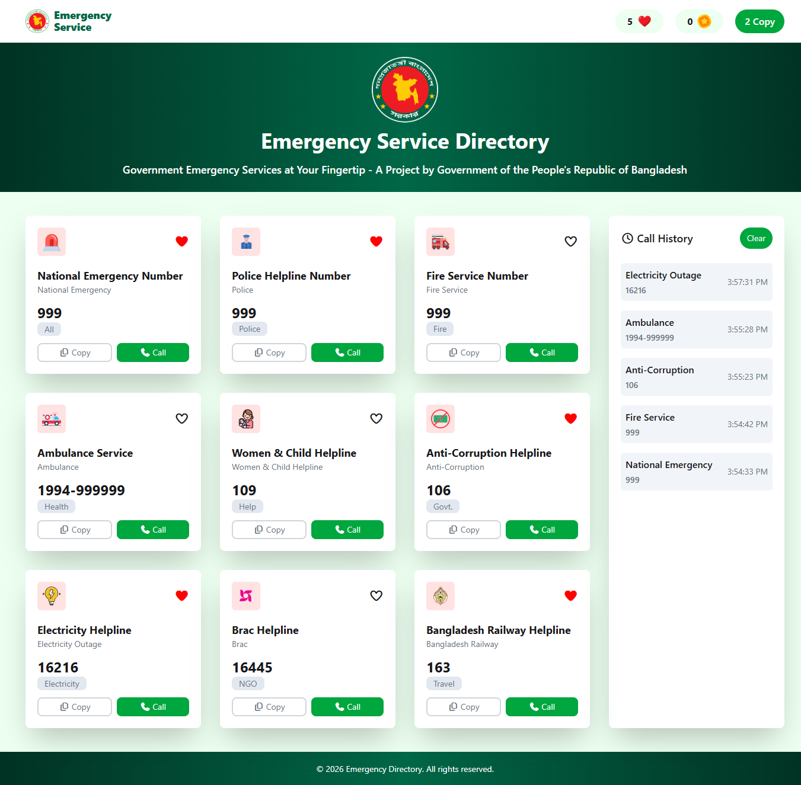
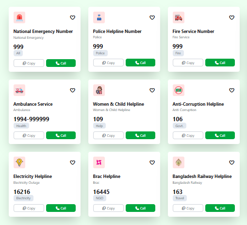
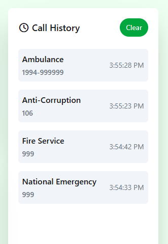
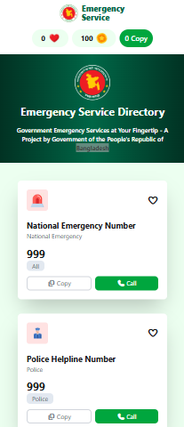

# Emergency Service Directory

A responsive web application providing instant access to emergency hotline numbers, with one-click copy, mock call functionality, and live call history tracking.

## Overview

**Emergency Service Directory** is designed to give users quick and reliable access to important emergency contact numbers — including national emergency services, police, fire service, ambulance, and more.

The interface allows users to:

- Copy hotline numbers directly to their clipboard
- Simulate placing a call, with a coin-based usage system
- Track every call made in a dynamic call history log
- Mark services as favourites using a like counter

The project was built with a strong focus on **clean UI design**, **interactive functionality**, and **full responsiveness** across mobile, tablet, and desktop devices.

---

## Live Demo

🔗 [View Live Demo](https://asm-saim.github.io/emergency-services-portal/)

---

## Tech Stack

| Layer       | Technology                  |
|-------------|------------------------------|
| Markup      | HTML5                        |
| Styling     | CSS3, Tailwind CSS, Daisy UI            |
| Logic       | Vanilla JavaScript (ES6+)      |
| Icons       | Font Awesome                  |

---

## Features

- **Responsive Navigation Bar** — Displays branding, like counter, coin balance, and copy counter across all device sizes.
- **Hero Section** — Showcases the platform identity with a centered logo, title, and slogan on a gradient background.
- **Emergency Service Directory** — Provides emergency hotline cards with service details, category labels, and quick actions.
- **Like System** — Allows users to mark services as favorites while tracking total likes.
- **Copy-to-Clipboard Functionality** — Instantly copies hotline numbers and updates the copy counter.
- **Call Simulation System** — Simulates emergency calls, deducts coins, validates balance, and displays service information.
- **Dynamic Call History** — Records call logs with service details and timestamps, with support for instant clearing.
- **Fully Responsive Layout** — Optimized for mobile, tablet, and desktop viewing experiences.

---

## Key Highlights

- Implemented a **dynamic card-to-history workflow** in Vanilla JS, where user actions update the navbar counters and history log in real time
- Built a **coin-based transaction system** with balance validation before each call
- Used the **Clipboard API** for seamless one-click number copying
- Achieved a **fully responsive layout** using Tailwind CSS grid and flex utilities
- Delivered a polished, self-contained UI with consistent interaction patterns across all components

---

## UI Screenshots

<table>
  <tr>
    <td align="center"><b>Home Page</b></td>
    <td align="center"><b>Hotline Cards Section</b></td>
  </tr>
  <tr>
    <td></td>
    <td></td>
  </tr>
  <tr>
    <td align="center"><b>Call History Section</b></td>
    <td align="center"><b>Mobile Responsive View</b></td>
  </tr>
  <tr>
    <td></td>
    <td></td>
  </tr>
</table>

---

## Usage Guide

| Action | Result |
|---|---|
| Click the heart icon on a card | Increases the like counter in the navbar |
| Click the Copy button | Copies the hotline number to clipboard and increases the copy counter |
| Click the Call button | Shows an alert, deducts 20 coins, and adds the call to the history |
| Click Clear in the History section | Removes all entries from the call history |

---

## Future Improvements

- Persist coin balance, like count, and call history using local storage
- Add a search/filter feature for hotline cards by category
- Add dark mode support
- Add user authentication for personalized history tracking

---

## Author

**A S M Saim**
- GitHub: [@asm-saim](https://github.com/asm-saim)
- LinkedIn: [A S M Saim](https://www.linkedin.com/in/asmsaim/)

---
